# week1_test

## Insert Api
1. **How long does it take to insert one image and this image can be searchable?**  
    It is tried to insert four images that is loaded from internet, it takes about total 3 min and 56 sec to finish indexing. The average processing time is 1min.
    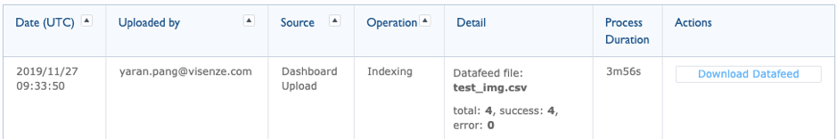

    It is tried to use tagging way of inserting the pictures, it took about 2 min and 13 sec to finish uploading pictures. The average processing time is 0.5min
    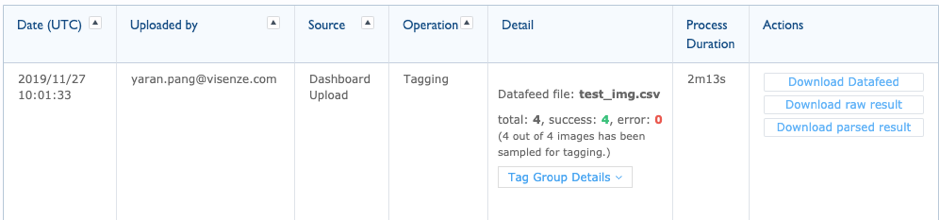

     It is tried to use one image to insert picture, it took about 11 second to finish uploading pictures with indexing file.
    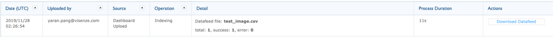

    It is tried yesterday using external connection, it took 4 min 59 second to finish uploading pictures with indexing file.
    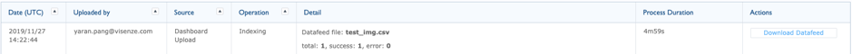

     
2. **Where can you get the application key for integrating a     new application?  Please paste the screenshot below**  
    In the new app, under integration -> Client-side Integration can see the app keys.
    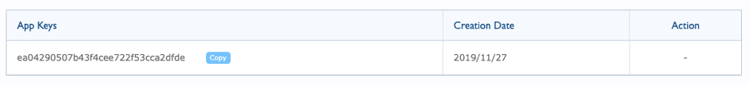

 

## Search Api

1. **Can you paste a screenshot of you successfully get the response from the Postman given an image URL as the input using /uploadsearch?**    
    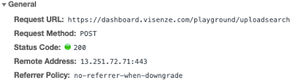

 

2. **What is the meaning of ‘fq’ and 'fl' parameter?**  
    The fl is the url field name which is same as the field name in upload .csv file. I did not see fq param in the params. 
    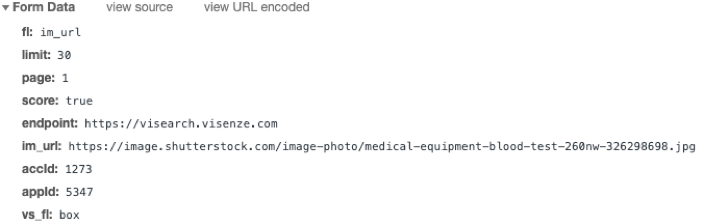  
    From development docs, it shows the definition of fl and fq
    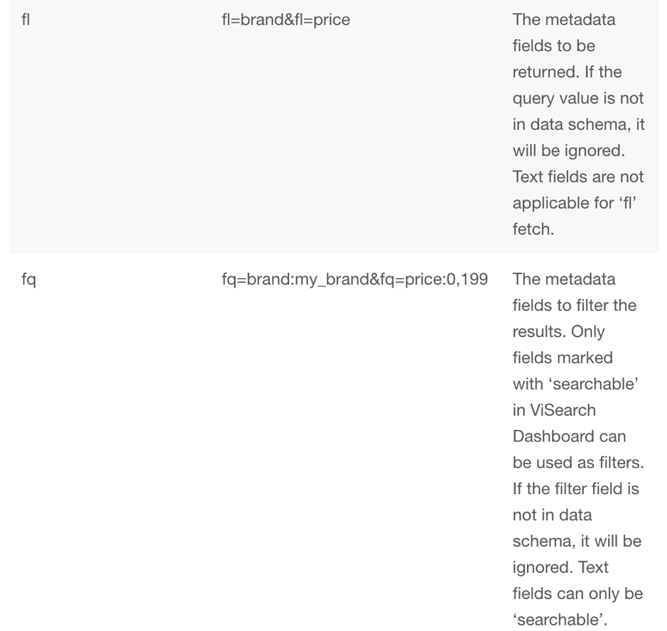

 

3. **What is the image size/resolution requirement/limitation for upload search?**  
    From the development document, the image size is 10MP, it is suggested to be around 1024 * 1024 pixels
    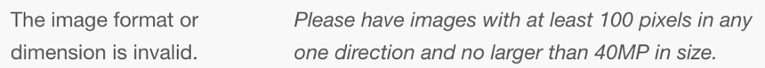
    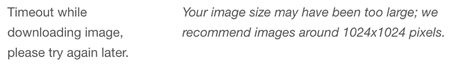
 

4.  **What does the similarity score mean?**    
    The similarity score suggest the percentage of similarity of the search image with images in the database with category or other metadata defined in the schema.

 

5. **What’re results will you return if you don’t find anything similar in our database?**  
    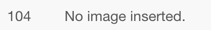
    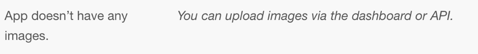
 

6. **Which search endpoints support automatic object detection?**   
    /v1/image/recognize  
 

7. **Which parameters to use when a user wants to filter by price? Please give an example parameter?**  
    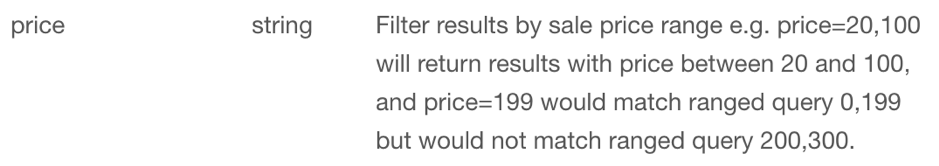
    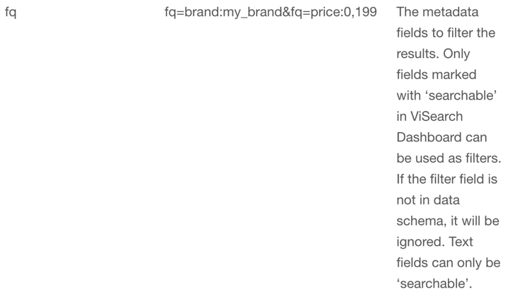
 

## Image database ingestion
1. **If the customer shares their images with ViSenze, how does ViSenze handle the data security?**  
    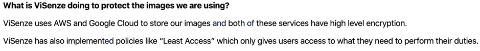

 
  
2. **What is the approximate indexing time for a new image given a base set of 500,000 images? Does this time increase linearly?**     
Not able to do experiment on this but from understanding the way system works, the priority is given to large size image file. Performance is auto scaled if more resouce is needed to process large amount of image files.
 

3. **Which are the mandatory fields of uploading images for furniture domain? What about fashion domain?**    
    Image Id(im_id), image url(im_url) and category(did not find difference from metadata definition). Category field is discarded with increasing accuracy of algorithm. Features extracted from image are more accurate to define image compare to previous version.

 

4. **Which are the supported methods for image database ingestion?**    
    method: post
    api: /insert

 

5. **Can an image database be deployed to more than 1 data centers?**    
    Yes. Can select more than one data centers.
    
 

## Visual Search Integration

1. **Is integration of  /search and /uploadsearch using Javascript feasible?**    
    visenze javascript sdk supports it.

 

2. **What is the throughput our visual search system can support? Does this scale horizontally?**  
The througput of search system can be adjusted based on the speed image provider can support. It can be scaled when the amount of images that needed to be searched is large.
 

3. **Does /uploadsearch support .ai files? If not, what is the error message?**    
    It does not support .ai file, the error message shows file format does not support.

 

4. **Which API is the fastest, which is the slowest, among /search, /uploadsearch, /discoversearch? Can you explain why?**    
    /search is the fastest. It is fast since it only search the image from the database that have been indexed.
    /discoversearch is the slowest. It needs to first indexing the image to find features and categorize all the features. Each feature categorization will show the results that has similar features.

 

**other**
1. **What are the metrics we currently use to evaluate our visual search result?**
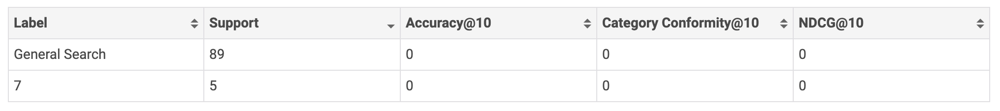

2. **How do you create an experiment in ViSenze’s search evaluation system? Please paste the screenshot below.**
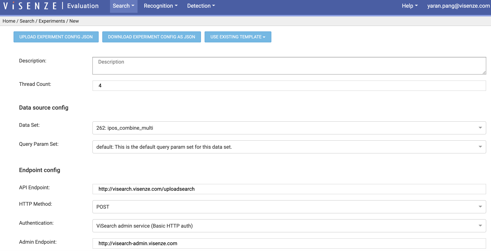
 

## Tagging API
1. **Can you paste a screenshot of you successfully get the response from the Postman given an image URL as the input?**
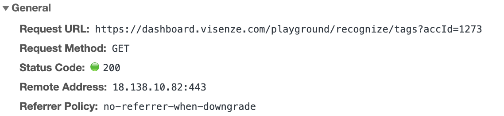
 

2. **For the image tagging response, what does the confidence score mean?**  
The score means the confidence that the answers match user queries
 

3. **What are the tag group we currently support in image Tagging API?**  
fashion_attributes, fashion_style, fashion_occasion, gender
 

4. **Can you list all the attribute value we can return for 'neckline'?**  
tags: [{"tag:"","score:"""}], box:[], "tag_group": "fashion_attribute";
 

5. **How do you get tagging results on the dashboard? Please paste the screenshot below.**
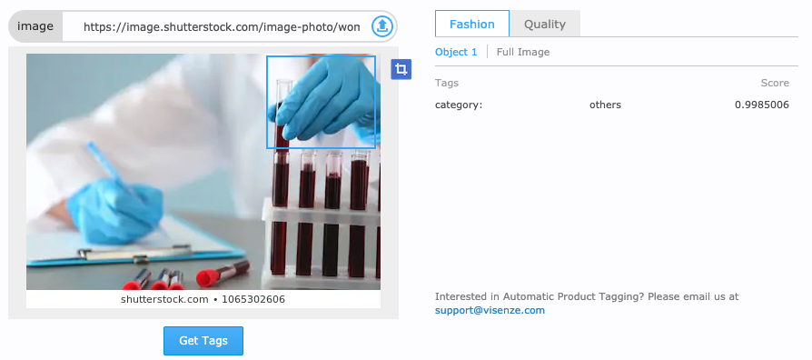
 

6. **How do you create an experiment in ViSenze’s recognition evaluation system? Please paste the screenshot below.**
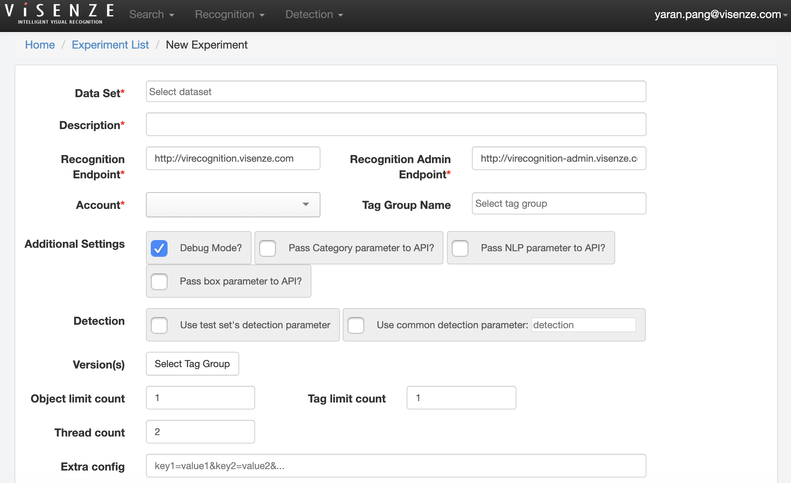
 

## ProductCat Api
1. **What are the differences between ProductCat database and a Visual Search client’s database?**  
Productcat database data is not paying for search, visual search client's database is enterprise customers that pay for search.  
 

2. **What is the meaning of “country” parameter?**
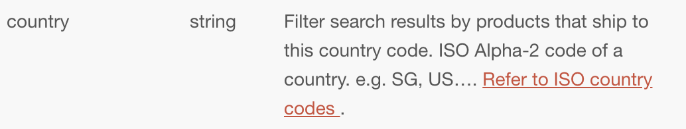
 

3. **How does ProductCat API track user actions?**  
It uses user identifier to track.
 

4. **Try “Egami” app from iOS store or “Egami demo” from Google Play. Please paste a screenshot of successfully taking a picture and search from the app.**

 

## Others
1. **Could you please describe what is the roadmap for your current team (for example, new 3 feature coming out) and what is the impact for the product or the business based on your understanding?  (maximum 100 words)**  
New fields in the database, new roles and new options for setting mode. It is customer facing platform. Customers can use the platform to create application and use visearch api.
 

2. **Could you please describe what are the key challenges we are faced with given your role in your team?  (maximum 100 words)**  
The features that are needed to be developed are planned and refactoring of application is along with development. The time needed to be allocated for both feature development and refactoring.
 

3. **Could you please describe what are the things you feel that we need to improve immediately compared to your previous experience? (maximum 100 words)**  
It is good if the new technologies are used in the project that will increase productivity of work.

